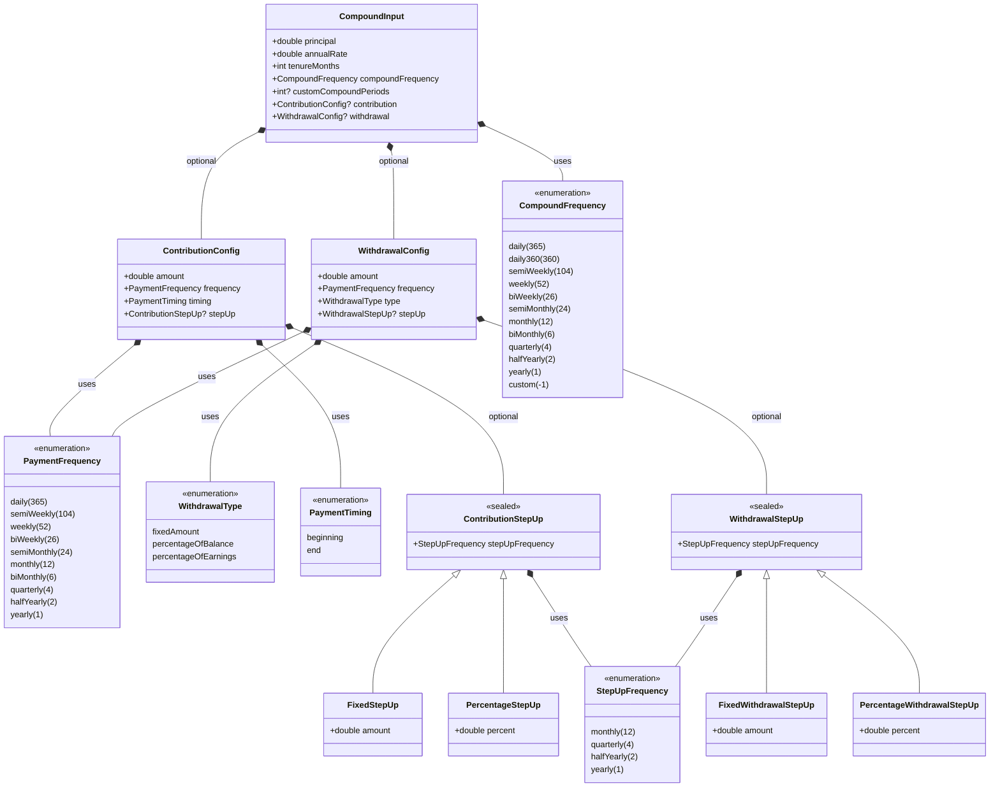

# Compound Input Structure

Here is a visual breakdown of the updated `CompoundInput` model, showcasing the new structurally safe `StepUpFrequency`.

### Key Takeaways
1. **The StepUp Safety**: Notice how `ContributionStepUp` and `WithdrawalStepUp` no longer point to the large `PaymentFrequency` enum. They strictly point to `StepUpFrequency`, locking out mathematically invalid sub-monthly periods from ever being instantiated.
2. **The Core Input (`CompoundInput`)**: The single source of truth passed to the calculator. It holds all base values (principal, rate, tenure) and the optional configs.
3. **The Withdrawal Types**: `WithdrawalConfig` relies on the `WithdrawalType` enum to determine if its `amount` field is a fixed currency value (₹) or a percentage multiplier (%).
4. **High Frequencies**: Both `CompoundFrequency` and `PaymentFrequency` now contain the full range of high-frequency options (weekly, semi-monthly, etc.).
